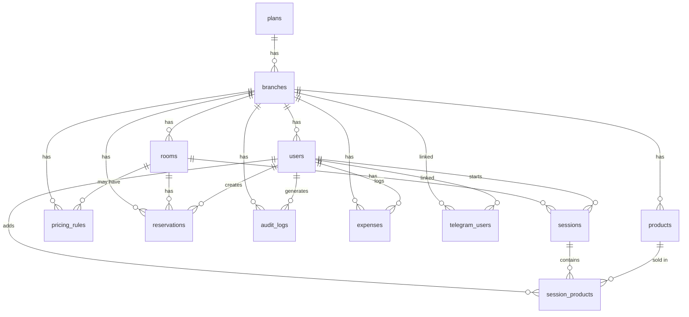

# 🗄️ VipLimit — Database Map

> Bu fayl loyihadagi barcha jadvallar va ularning o'zaro aloqalarini ko'rsatadi.
> Har bir yangi sahifa yoki bo'lim qo'shilganda ushbu fayl yangilanadi.

## 📋 CHANGE LOG:
<!-- 2026-04-03 01:28 (Tashkent) — 🤖 TG Mini App: telegram_users, plans, promo_codes qo'shildi -->

## 📊 Jadvallar ro'yxati

| # | Jadval nomi | Izoh | Sahifa |
|---|-------------|------|--------|
| 1 | `branches` | Filiallar / Game Clublar | Settings / Super Admin |
| 2 | `users` | Adminlar, Managerlar, Ownerlar | Settings / Login |
| 3 | `rooms` | Xonalar va ularning narxlari | Rooms Dashboard |
| 4 | `pricing_rules` | Narxlash qoidalari (tungi, promo) | Settings |
| 5 | `sessions` | O'yin sessiyalari (asosiy billing) | Rooms Dashboard |
| 6 | `reservations` | Xona bron qilish | Rooms Dashboard |
| 7 | `products` | Mahsulotlar (inventory) | Products Page |
| 8 | `session_products` | Sessiyada sotilgan mahsulotlar | Rooms Dashboard |
| 9 | `audit_logs` | Nazorat jurnali (xavfsizlik) | Owner Panel |
| 10 | `expenses` | Operatsion xarajatlar | Expenses Page |
| 11 | `plans` | Tarif rejalar (Free/Pro/Enterprise) | Super Admin |
| 12 | `promo_codes` | Promokodlar | Super Admin |
| 13 | `telegram_users` | TG ↔ Game Club bog'lanishi | Bot / Auto-login |

## 🔗 Jadvallar aloqalari

## 📄 Sahifalar va jadvallar bog'lanishi

| Sahifa | Ishlatadigan jadvallar | Izoh |
|--------|----------------------|------|
| **Login / Onboarding** | `users`, `telegram_users`, `branches` | Autentifikatsiya + yangi club |
| **Rooms Dashboard** | `rooms`, `sessions`, `session_products`, `reservations`, `products` | Asosiy ish paneli |
| **Products** | `products` | Mahsulotlar CRUD + Inventory |
| **Reports** | `sessions`, `session_products`, `products`, `rooms` | Hisobotlar |
| **Expenses** | `expenses`, `users` | Xarajatlar kiritish va ko'rish |
| **Settings** | `users`, `branches`, `pricing_rules`, `rooms` | Sozlamalar |
| **Audit Logs** | `audit_logs` | Nazorat jurnali (faqat Owner) |
| **🔒 Super Admin** | `branches`, `plans`, `promo_codes`, `telegram_users` | Clublar, tariflar, promokodlar |
